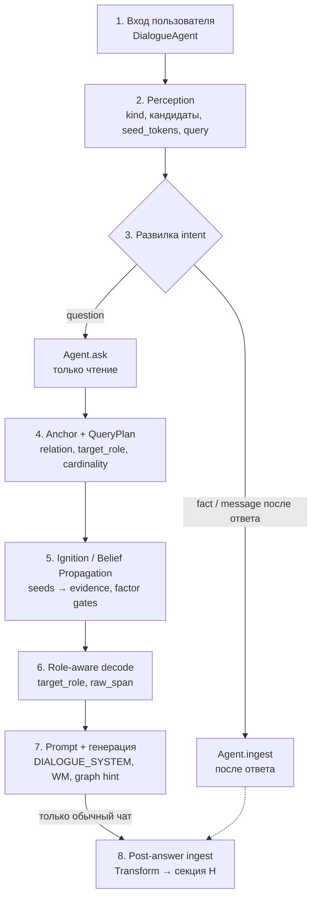
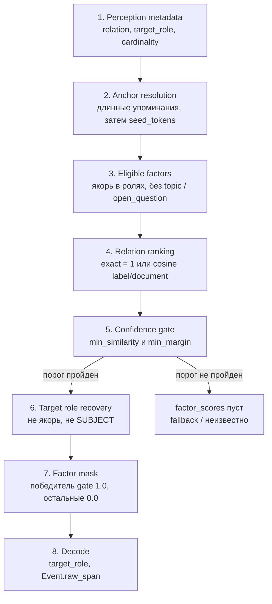
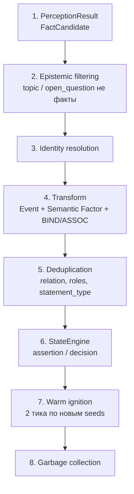
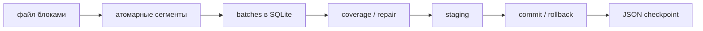
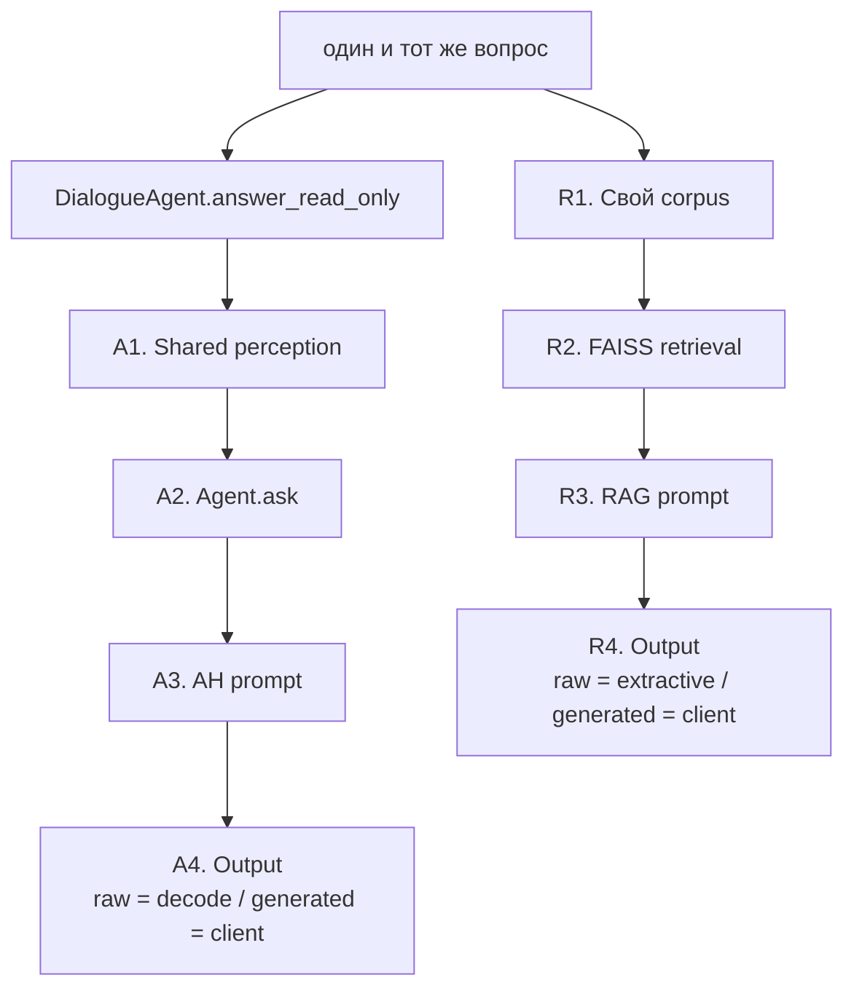
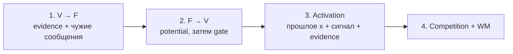

# Полный pipeline работы AH-агента

Интерактивная вёрстка канваса живёт только в служебной папке Cursor
(`.cursor/projects/.../canvases/*.canvas.tsx`). Этот файл — та же схема
для репозитория: открывайте превью Markdown (`Ctrl+Shift+V`).

**Главный принцип.** Один и тот же [read-only](#term-readonly) маршрут
готовит ответ АГ для чата и для сравнения. Только обычный чат после ответа
записывает реплики в граф ([ingest](#term-ingest)).

При успешном [QueryPlan](#term-queryplan) итоговые значения берёт
[decoder](#term-decode) из выбранных [факторов](#term-semantic-factor).
[Belief Propagation](#term-bp) объясняет зажигание и готовит контекст,
но это пока не multi-hop reasoning engine.

- [Общий маршрут](#общий-маршрут)
- [Вопрос и QueryPlan](#вопрос-и-queryplan)
- [Запись в граф](#запись-в-граф)
- [Чат и сравнение](#чат-и-сравнение)
- [Состояние и веса](#состояние-и-веса)
- [Словарь](#словарь)

---

## Общий маршрут

**Что делает схема.** Показывает одну пользовательскую реплику целиком:
как текст разбирают, как на вопрос отвечают из графа и когда (только
в чате) реплики после ответа записывают в память. Это карта контура,
не алгоритм «слово за словом».

Пояснения узлов:
[DialogueAgent](#term-dialogueagent) ·
[Perception](#term-perception) ·
[QueryPlan](#term-queryplan) ·
[BP](#term-bp) ·
[decode](#term-decode) ·
[prompt](#term-prompt) ·
[ingest](#term-ingest) ·
[ask](#term-ask)

### Что происходит на схеме

Чат (`DialogueAgent.talk`) и сравнение (`CompareEngine.ask`) оба входят в
`answer_read_only`. Это шаги 1–7. Шаг 8 есть только у чата.

1. **Вход.** Текст пользователя. Чат сразу идёт в `talk`. Сравнение
   вызывает тот же `answer_read_only`, но с `generate` по режиму
   (без LLM / с LLM) и **не** вызывает `ingest`.
2. **Perception.** Сначала сбрасываются [gates](#term-gate), [BP](#term-bp)
   [сообщения](#term-message) и query-[WM](#term-wm): прошлый вопрос не
   должен светить в этот. Из текущей [WM](#term-wm) ранжируются карточки
   под формулировку (`GraphContextRanker`). Parser (LLM или seeds)
   возвращает `kind`, [FactCandidate](#term-factcandidate),
   [`seed_tokens`](#term-seed) и, если есть, `query` ([relation](#term-relation),
   [target_role](#term-target-role), [cardinality](#term-cardinality)).
   `kind`: `question` / `fact` / `message` — по `?`, полям `query` и
   `statement_type` кандидатов, без списков фраз.
3. **Развилка intent.** В `answer_read_only` [ask](#term-ask) вызывается
   всегда: для вопроса — полный бюджет тиков, для факта/реплики —
   короче (`min(ticks, 2)`), чтобы слегка подсветить семена, не гоняя
   полный query. На схеме «question → ask» — основной путь ответа.
   «fact / message → ingest» срабатывает **после** ответа и только в чате
   (шаг 8): вопрос как целое в граф не пишется.
4. **Anchor + QueryPlan.** `Agent.ask` ищет в тексте самые длинные
   упоминания сущностей из [S](#term-s)/[M](#term-m), иначе —
   [`seed_tokens`](#term-seed). Это [якоря](#term-anchor). Планировщик
   выбирает соседние factual [factors](#term-semantic-factor), одну
   [relation](#term-relation) и [target_role](#term-target-role). Подробности —
   в [Вопрос и QueryPlan](#вопрос-и-queryplan).
5. **Ignition / BP.** По `factor_scores` ставятся [gates](#term-gate)
   (победитель `1.0`, остальные `0.0`; пустой план — маски нет).
   [Seeds](#term-seed) кладут [evidence](#term-evidence). Несколько тиков
   [BP](#term-bp): V→F, F→V, [activation](#term-activation),
   [competition](#term-competition), порог [WM](#term-wm). Структура
   [AHStore](#term-ahstore) здесь не меняется.
6. **Decode.** Если план уверенный, ответ читается из выбранных факторов:
   слот [target_role](#term-target-role), цитата
   [raw_span](#term-raw-span), для `cardinality=one` — первое значение.
   Если `factor_scores` пуст или decode пуст — старый compose по
   [трассировке](#term-trace) / [fallback](#term-fallback). Это строка
   `ask.answer` (graph hint), ещё не реплика чата.
7. **Prompt + генерация.** Собирается AH [prompt](#term-prompt):
   `DIALOGUE_SYSTEM` + сжатый контекст (ranked факты / [WM](#term-wm),
   без сырых [UID](#term-uid)). Если генерация включена и клиент есть —
   один вызов модели: system = этот промпт, user = исходный текст.
   Если генерации нет (compare «без LLM») — наружу идёт `ask.answer`.
   RAG в этом шаге не участвует: у сравнения он отдельный рукав на тех
   же документах.
8. **Post-answer ingest (только чат).** Сначала в секцию [H](#term-h)
   пишется реплика пользователя: [Transform](#term-transform), 2 тика
   подогрева, [GC](#term-gc). Если `kind` был `question`, сам вопрос
   отбрасывается, остаются только явные факты в смешанной реплике.
   Затем разбирается ответ ассистента (`proposal` / `explanation`) и
   тоже пишется в [H](#term-h). История чата (до 24 реплик) идёт в
   [RAG](#term-rag)-[корпус](#term-corpus), не в дамп факторов.
   Сравнение шаг 8 пропускает: граф и история после compare те же.

Перед вопросом сбрасываются [BP](#term-bp)-сообщения и query-[WM](#term-wm),
сам [AHStore](#term-ahstore) не трогается.

**Не меняется при вопросе:** структура [AHStore](#term-ahstore),
[Events](#term-event), [provenance](#term-provenance), [RAG](#term-rag)-[корпус](#term-corpus).

**Создаётся на запрос:** PerceptionResult, [QueryPlan](#term-queryplan),
[evidence](#term-evidence), [BP](#term-bp) [messages](#term-message),
[activation](#term-activation), [Working Memory](#term-wm),
[contribution](#term-trace) [trace](#term-trace), AH [prompt](#term-prompt).

---

## Вопрос и QueryPlan

Текущая форма — **[one-hop](#term-onehop) schema-aware retrieval**:

[якорь](#term-anchor) → соседние factual [factors](#term-semantic-factor)
→ одна [relation](#term-relation)-победительница → значения одной
[target_role](#term-target-role).

**Что делает схема.** По вопросу ищет в графе не «похожий текст», а
конкретный факт рядом с сущностью из формулировки. Сначала понимает,
*какую связь* спрашивают и *какой слот* вернуть (кто / что / где).
Потом находит якорь, отбирает соседние факты, выбирает одну связь.
Если уверенность низкая — план бросает, ответ «неизвестно» или запасной
путь. Если уверенная — читает цитату из выбранных факторов. Цепочки
A→B→C здесь нет: только соседи якоря.

Пояснения узлов:
[Perception](#term-perception) ·
[anchor](#term-anchor) ·
[factor](#term-semantic-factor) ·
[relation](#term-relation) ·
[margin](#term-margin) ·
[target_role](#term-target-role) ·
[gate](#term-gate) ·
[decode](#term-decode) ·
[fallback](#term-fallback)

### Как строится план

1. **[Perception](#term-perception) metadata.** Из `meta.llm_raw.query`
   читаются [relation](#term-relation), [target_role](#term-target-role),
   [cardinality](#term-cardinality). Кандидаты
   [`topic`](#term-topic) / [`open_question`](#term-open-question) дают
   дополнительный relation intent.
2. **[Anchor](#term-anchor) resolution.** Сначала самые длинные точные
   упоминания в тексте, затем [`seed_tokens`](#term-seed) и формы
   AbstractSymbol ([S](#term-s)). Результат — [UID](#term-uid)-якоря.
3. **Eligible [factors](#term-semantic-factor).** Factual factors, в
   [ролях](#term-subject) которых есть [якорь](#term-anchor).
   [`topic`](#term-topic), [`open_question`](#term-open-question),
   [`proposal`](#term-proposal), [`explanation`](#term-explanation)
   исключаются.
4. **[Relation](#term-relation) ranking.** Точное canonical совпадение →
   score 1. Иначе `0.7 × cosine(query, label) + 0.3 × cosine(query, document)`
   ([embedding](#term-embedding)). Для [`many`](#term-cardinality) — бонус
   за число разных target values.
5. **Confidence [gate](#term-gate).** Лучшая [relation](#term-relation)
   должна пройти `min_similarity` и оторваться от второй на
   [`min_margin`](#term-margin). Иначе план отвергается.
6. **[Target role](#term-target-role) recovery.** Если роли LLM нет в
   factors, берётся наиболее покрытая роль, не [якорь](#term-anchor) и не
   [SUBJECT](#term-subject); при равенстве — [OBJECT](#term-object).
7. **Factor mask.** Победившая [relation](#term-relation) с нужной ролью:
   [gate](#term-gate) `1.0`. Остальные semantic paths: `0.0`.
8. **[Decode](#term-decode).** Читает [target_role](#term-target-role),
   убирает дубли, использует [Event](#term-event).[raw_span](#term-raw-span),
   группирует перечисления. [`cardinality=one`](#term-cardinality) оставляет
   первое значение.

### Контракт [QueryPlan](#term-queryplan)

| Поле | Тип | Смысл |
|------|-----|--------|
| `anchors` | tuple [UID](#term-uid) | Сущности из формулировки вопроса. См. [anchor](#term-anchor) |
| `relation_text` | string | Intent LLM + [relation](#term-relation) кандидатов + слова вопроса |
| `target_role` | role | Какой слот вернуть. См. [target_role](#term-target-role) |
| `cardinality` | [`one`](#term-cardinality) \| [`many`](#term-cardinality) | Одно значение или список |
| `relation_scores` | map | Диагностика ранжирования [relation](#term-relation) |
| `factor_scores` | map | Маска для [BP](#term-bp) и набор [factors](#term-semantic-factor) для [decoder](#term-decode) |

**[Gate](#term-gate) [сообщения](#term-message):** `p′ = 0.5 + (p − 0.5) × gate`.  
Gate 1 пропускает сообщение, gate 0 делает его нейтральным `0.5`.
Prior и observation factors маской не глушатся.

| Ситуация | Поведение |
|----------|-----------|
| План уверенный | Выбранные [factors](#term-semantic-factor) → gated [BP](#term-bp) → direct [decode](#term-decode) |
| [Relation](#term-relation) ниже порога | `factor_scores` пуст; ответ плана «неизвестно» |
| План пуст | [BP](#term-bp) без маски; возможен шумный [fallback](#term-fallback) |
| [Decoder](#term-decode) пуст | Старый [trace](#term-trace)-based compose |

---

## Запись в граф

**Что делает схема.** Как утверждение из текста становится узлами памяти.
Парсер ещё не пишет в граф: он предлагает кандидатов. Дальше отсекают
«это не факт», решают «это та же сущность или новая», создают символ,
событие, фактор и связи. Повторы склеивают. Явные `key=value` могут
обновить State. Новые узлы коротко подогревают, мусор собирают.
Вопрос целиком по этой схеме не записывается.

Пояснения узлов:
[FactCandidate](#term-factcandidate) ·
[topic](#term-topic) ·
[Identity](#term-identity) ·
[Transform](#term-transform) ·
[relation](#term-relation) ·
[StateEngine](#term-stateengine) ·
[ignition](#term-ignition) ·
[gc](#term-gc)

Один факт порождает: AbstractSymbol ([S](#term-s)), SecondOrderSymbol
([M](#term-m)-узел), [Event](#term-event),
[SemanticFactor](#term-semantic-factor), AssocLink ([L](#term-l)).

**[Provenance](#term-provenance).** [Event](#term-event) и
[Factor](#term-semantic-factor) хранят source, raw [relation](#term-relation),
[statement_type](#term-assertion), metadata кандидата, а при потоковой
загрузке — job, batch и offsets.

**Потоковый [ingest](#term-ingest) большого текста**
([StreamingGraphIngestor](#term-stream-ingest)):

**Что делает схема.** Как прожевать длинный файл, не запихивая его
целиком в один вызов модели и не теряя работу при обрыве. Файл читают
блоками, режут на атомарные куски, пачками кладут в SQLite. Каждый кусок
должен быть покрыт кандидатом, иначе разбор повторяют. Кандидаты сначала
лежат в staging; в живой граф попадают только после успешного commit.
Сбой откатывает граф к снимку, журнал остаётся. Продолжение не зовёт
модель заново для уже извлечённых пачек. Сам граф после записи всё ещё
в оперативной памяти.

Пояснения узлов:
[stream ingest](#term-stream-ingest) ·
[coverage](#term-coverage) ·
[staging](#term-staging) ·
[commit](#term-commit)

Resume не вызывает LLM повторно для уже извлечённых batches.

---

## Чат и сравнение

Чат и [compare](#term-compare) используют
[`DialogueAgent.answer_read_only`](#term-dialogueagent).
[Perception](#term-perception), [QueryPlan](#term-queryplan),
[ignition](#term-ignition), compact AH context и AH
[system prompt](#term-prompt) совпадают при одинаковом графе и вопросе.

**Что делает схема.** Один и тот же вопрос идёт в два независимых рукава.
Слева АГ: общее восприятие, чтение графа, свой промпт, ответ из decode
или из модели по контексту графа. Справа RAG: свой корпус (документы и
история, не дамп факторов), поиск похожих кусков, свой промпт, вырезка
или отдельный вызов той же диалоговой модели. Это не один запрос «ответь
двумя способами». Сравнение граф не меняет; обычный чат после ответа
пишет реплики.

Пояснения узлов:
[read-only](#term-readonly) ·
[Perception](#term-perception) ·
[ask](#term-ask) ·
[prompt](#term-prompt) ·
[generated](#term-generated) ·
[corpus](#term-corpus) ·
[FAISS](#term-faiss) ·
[RAG](#term-rag) ·
[extractive](#term-extractive)

| Режим | [Perception](#term-perception) АГ | AH [prompt](#term-prompt) | Генерация | Запись в граф |
|-------|---------------|-----------|-----------|---------------|
| Обычный чат | Shared LLM/[seed](#term-seed) | Полный | Dialogue client | После ответа |
| Compare без LLM-генерации | Тот же path | Подготовлен и показан | Нет | Нет |
| Compare с LLM | Тот же path | Тот же, что у чата | Один client для АГ и [RAG](#term-rag) | Нет |
| M4 benchmark | Изолированный path | Не UI-dialogue | По конфигу бенчмарка | Нет |

[Compare](#term-compare) API отдаёт `ah_answer` / `rag_answer`,
`ah_prompt` / `rag_prompt`, `ah_full_trace` / `ah_perception`,
[чанки](#term-chunk) и `shared_ah_pipeline`.

Ответы всё равно могут различаться: разные хранилища; чат после ответа
меняет граф, compare — нет; [extractive](#term-extractive) /
[generated](#term-generated) — разные уровни обработки.

---

## Состояние и веса

**Постоянное:** [AHStore](#term-ahstore), `factor.w` (не растёт от обычного
зажигания), `AssocLink.w` ([Hebb](#term-hebb) только если
`fg_hebb_enabled=true`), [GraphLibrary](#term-graphlibrary) JSON.

**На запрос:** [evidence](#term-evidence), [BP](#term-bp)
[messages](#term-message), [activation](#term-activation) ∈ [0, 1],
[WorkingMemory](#term-wm) (символы выше `threshold_t`).

### Один [BP](#term-bp) tick

**Что делает схема.** Один такт зажигания: как «яркость» перетекает между
символами и факторами. Сначала символы говорят факторам, насколько они
активны (с учётом внешнего импульса на семена). Потом фактор по своему
правилу отвечает символам; маска плана может заглушить чужие пути.
Дальше обновляется яркость узла, слабые гасятся конкуренцией, в рабочую
память попадают те, кто выше порога. Это объяснение фокуса, не выбор
окончательного ответа, если план уже выбрал факторы.

Пояснения узлов:
[message](#term-message) ·
[potential](#term-potential) ·
[activation](#term-activation) ·
[competition](#term-competition)

Не все участники [фактора](#term-semantic-factor) загораются:
[damping](#term-damping), [gate](#term-gate),
[конкуренция](#term-competition) и порог могут оставить символ тёмным.

[Hebb](#term-hebb) (по умолчанию выкл.): `w′ = clamp(w + η × x₁ × x₂, 0, 1)`
на рёбрах [L](#term-l), не на semantic factor weights.

| Событие | [BP](#term-bp) / [WM](#term-wm) | [AHStore](#term-ahstore) | History |
|---------|---------|---------|---------|
| Новый [read-only](#term-readonly) вопрос | Сбрасывается | Сохраняется | Сохраняется |
| [Ingest](#term-ingest) факта | Подогревается [seeds](#term-seed) | Изменяется | Не обязательно |
| Обычный chat turn | [Ask](#term-ask), затем ingest ticks | Может измениться | Добавляется turn |
| Compare turn | Временная [activation](#term-activation) | Факты не добавляются | Не добавляется |
| Load graph | Пересоздаётся | Заменяется snapshot | Сбрасывается |

---

## Словарь

Ссылка `[QueryPlan](#term-queryplan)` прыгает на заголовок
`#### term-queryplan`. Открывайте превью (`Ctrl+Shift+V`) или
Ctrl+Click в редакторе. Клики по узлам Mermaid сюда не ведут —
под схемами есть те же ссылки текстом.

### Слои графа и идентификаторы

#### term-ah

**AH** — associative-heterarchical memory: не простой граф «узел–ребро», а
несколько слоёв со ссылками разных типов.

#### term-s

**S** — слова / абстрактные символы. Нормализованная сущность и текстовые формы.

#### term-m

**M / M_…** — символ второго порядка. Конкретное вхождение в секции; на него
ссылаются факты.

#### term-c

**C** — общее. Факты корпуса, не диалог.

#### term-p

**P** — личное. Персональные данные.

#### term-h

**H** — история. Реплики пользователя и предложения ассистента.

#### term-l

**L** — связи. BIND, ASSOC, IS-A, FOLLOW, CAUSE — структурный слой.

#### term-event

**Event** — событие-утверждение. «кто–связь–кого» + цитата
[raw_span](#term-raw-span).

#### term-semantic-factor

**Semantic Factor / SF** — семантический фактор.
[relation](#term-relation) + роли → [UID](#term-uid); по нему идёт зажигание.

#### term-uid

**UID** — идентификатор. Строковый ключ; в ответе берутся label /
[raw_span](#term-raw-span).

#### term-tau

**τ / tau** — такт памяти. Счётчик шагов; `created_tau` у новых узлов.

Префиксы в трассировке: `M_` сущность, `SF::` фактор, `PRIOR::` априор,
`EP_` эпизод, `L_` ребро.

### Модули

#### term-perception

**perception.** Модуль `perception.py`. Восприятие текста. Не отвечает и не
пишет в граф. Текст + карточки [WM](#term-wm) → PerceptionResult:
[kind](#term-kind), [FactCandidate](#term-factcandidate),
[seed_tokens](#term-seed). [Gate](#term-gate) отбрасывает незаземлённые роли.

#### term-factcandidate

**FactCandidate.** Ещё не узел, а предложение парсера:
[relation](#term-relation), роли, [raw_span](#term-raw-span), confidence,
[statement_type](#term-assertion). [Transform](#term-transform) превратит его
в [Event](#term-event) и [Factor](#term-semantic-factor).

#### term-agent

**Agent.** `agent.py` — оркестратор. [ingest](#term-ingest):
[perception](#term-perception) → [Transform](#term-transform) → короткое
зажигание → [GC](#term-gc). [ask](#term-ask): якоря →
[QueryPlan](#term-queryplan) → [gates](#term-gate) →
[ignition](#term-ignition) → [decode](#term-decode). LLM-диалог здесь не
ведётся.

#### term-dialogueagent

**DialogueAgent.** `dialogue.py` — чат. `answer_read_only` — общий путь с
[compare](#term-compare). `talk` после ответа пишет реплики в секцию
[H](#term-h).

#### term-transform

**Transform.** `transform.py` — единственный штатный писатель фактов:
нормализация [связи](#term-relation), [UID](#term-uid), [Event](#term-event),
[Factor](#term-semantic-factor), BIND/ASSOC, дедуп.

#### term-ahstore

**AHStore.** `store.py` — живой граф в RAM:
[S](#term-s)/[C](#term-c)/[P](#term-p)/[H](#term-h)/[L](#term-l)
+ relations, events, factors, state. Большой текст читается кусками,
построенный граф должен помещаться в память.

#### term-identity

**Identity.** «Это та же сущность?». Ниже порога merge не делается.

#### term-queryplan

**GraphQueryPlanner / QueryPlan.** `graph_query.py` — [якоря](#term-anchor),
одна [relation](#term-relation), маска [факторов](#term-semantic-factor),
[decode](#term-decode) из [raw_span](#term-raw-span).
[Одношаговый](#term-onehop) поиск, не язык запросов.

#### term-ignition

**IgnitionEngine.** `ignition.py` — «посеяли [UID](#term-uid) → несколько
тактов». [Seeds](#term-seed) в [evidence](#term-evidence), шаг [BP](#term-bp),
синхрон [WM](#term-wm). При вопросе BP сбрасывается, факты — нет.

#### term-bp

**Belief Propagation.** Обмен [сообщениями](#term-message) «насколько узел
активен». V→F, затем F→V, [gate](#term-gate) вокруг нейтрали 0.5,
[activation](#term-activation), [competition](#term-competition).

#### term-factorgraph

**FactorGraph.** Расчётный адаптер [AHStore](#term-ahstore) для [BP](#term-bp),
не вторая копия памяти.

#### term-wm

**WorkingMemory.** Символы с [activation](#term-activation) ≥ `threshold_t`.
Не ответ и не весь граф, а текущий фокус. В [промпт](#term-prompt) идут
ranked карточки без сырых [UID](#term-uid).

#### term-contextranker

**GraphContextRanker.** Лексика вопроса + [activation](#term-activation) +
[gates](#term-gate); мусор в [промпт](#term-prompt) не кладётся.

#### term-stateengine

**StateEngine.** Явные `key=value` по
[assertion](#term-assertion)/[decision](#term-decision), не
[активация](#term-activation).

#### term-dsl

**DSLInterpreter.** Запасной `answer_who(...)`, если план пуст. См.
[fallback](#term-fallback).

#### term-gc

**gc.** Осиротевшие временные узлы; корпусные
[factors](#term-semantic-factor) не стирает.

#### term-compare

**CompareEngine.** АГ через `answer_read_only`, [RAG](#term-rag) через
[FAISS](#term-faiss) по своему [корпусу](#term-corpus). В граф не пишет.

#### term-faiss

**FAISS.** Индекс для поиска [чанков](#term-chunk). Часть
[RAG](#term-rag)-линии, не графа.

#### term-rag

**VanillaRAG / RAG.** [Чанки](#term-chunk) исходного текста, не дамп
факторов. Сначала найти куски, потом опционально сгенерировать. Контроль
рядом с АГ, не часть графа.

#### term-graphlibrary

**GraphLibrary / store_codec.** JSON snapshot/restore именованных графов.

#### term-stream-ingest

**StreamingGraphIngestor / IngestJournal.** Блоки файла, SQLite journal,
[staging](#term-staging), транзакционный [commit](#term-commit), resume без
повторного LLM.

### Англицизмы вопроса

#### term-ingest

**ingest.** Буквально «внести». Разобрать текст и записать факты. Вопрос не
должен стать [assertion](#term-assertion).

#### term-ask

**ask.** Только чтение: [якоря](#term-anchor), план, зажигание,
[decode](#term-decode). Граф фактов не меняется.

#### term-readonly

**read-only.** Путь ответа без [Transform](#term-transform). Чат и сравнение
делят его; чат потом отдельно пишет реплики.

#### term-kind

**kind.** Класс реплики: `fact` / `question` / `message`.

#### term-seed

**seed / seed_tokens.** Стартовые [UID](#term-uid), которым дают
[evidence](#term-evidence), чтобы зажигание началось не со всего графа.

#### term-anchor

**anchor.** Сущность из формулировки вопроса. Поиск
[factors](#term-semantic-factor) идёт от неё.

#### term-relation

**relation.** Имя предиката; canonical — `UPPER_SNAKE`.

#### term-target-role

**target_role.** Какой слот вернуть. «Какие ресурсы» → [OBJECT](#term-object),
«где» → [LOCATION](#term-location).

#### term-cardinality

**cardinality.** `one` — одно значение, `many` — перечисление всех.

#### term-onehop

**one-hop.** Только соседи [якоря](#term-anchor), не цепочка A→B→C.

#### term-embedding

**embedding.** Числовой портрет текста. У [QueryPlan](#term-queryplan)
локальный детерминированный вектор, не эмбеддинг GigaChat.

#### term-margin

**margin.** Отрыв лучшей [relation](#term-relation) от второй. Маленький
зазор → план отвергается.

#### term-fallback

**fallback.** Если LLM не заполнил `query.relation` или [decode](#term-decode)
пуст: вывод из текста вопроса / старый compose по [трассировке](#term-trace).

#### term-gate

**factor gate / mask.** Число 0…1 на каждом [факторе](#term-semantic-factor).
0 превращает [сообщение](#term-message) в нейтраль, 1 пропускает полностью.

#### term-decode

**decode.** Собрать ответ из выбранных [факторов](#term-semantic-factor):
цитаты, группировка списков. Не свободная генерация.

#### term-raw-span

**raw_span.** Точная непрерывная цитата из источника. Предпочтительнее
[UID](#term-uid)-лейбла в ответе.

#### term-prompt

**prompt / system prompt.** Инструкция + контекст АГ. Пользователь видит её
кнопкой в UI. Это не сам граф.

### Зажигание

#### term-evidence

**evidence.** Не вечный вес факта. Внешний импульс на [seed](#term-seed) на
время запроса. Затухает; между вопросами сбрасывается.

#### term-message

**message V→F / F→V.** Не реплика чата. Пара чисел (неактивен, активен),
которую переменная шлёт [фактору](#term-semantic-factor) и наоборот.

#### term-potential

**potential.** Правило, как [фактор](#term-semantic-factor) из входящих
[сообщений](#term-message) считает исходящие. PAIR, HYPER, OBS, PRIOR —
разные виды.

#### term-damping

**damping.** Смешивание нового [сообщения](#term-message) со старым, чтобы
[BP](#term-bp) не дёргался.

#### term-activation

**activation x.** Не бит вкл/выкл. Непрерывная яркость 0…1: прошлое `x` +
сигнал факторов + [evidence](#term-evidence), затем
[competition](#term-competition).

#### term-competition

**competition.** Глобальное торможение или top-k: слабые узлы гаснут, чтобы
фокус не расползался.

#### term-trace

**trace / contribution.** Какой [фактор](#term-semantic-factor) на сколько
изменил сообщение к символу. Для UI и объяснения; при успешном плане не
выбирает ответ.

#### term-hebb

**Hebbian update.** Если два конца ребра [L](#term-l) одновременно яркие,
вес ребра растёт. По умолчанию выключено; веса semantic factors это не
трогает.

### statement_type

Не тема текста, а можно ли считать высказывание фактом графа.

#### term-assertion

**assertion** — утверждает связь. Пишется как факт.

#### term-decision

**decision** — зафиксированное решение. Пишется как факт, может обновить State.

#### term-topic

**topic** — предмет без истины. Как факт не пишется.

#### term-open-question

**open_question** — нерешённый вопрос. Как факт не пишется.

#### term-proposal

**proposal** — вариант ассистента. Пишется как предложение.

#### term-explanation

**explanation** — пояснение ассистента. Пишется как пояснение.

### Роли

Роль — слот связи, не «профессия». Одна роль — одна сущность.

#### term-subject

**SUBJECT** — кто / что — подлежащее связи.

#### term-object

**OBJECT** — кого / что; часто ответ на «какие ресурсы».

#### term-location

**LOCATION** — где.

#### term-time

**TIME** — когда.

#### term-cause

**CAUSE** — из-за чего.

#### term-tool

**TOOL / MATERIAL** — чем / из чего.

#### term-purpose

**PURPOSE / HOW-TO** — зачем / каким образом.

#### term-with

**WITH** — вместе с чем.

### Сравнение и RAG

#### term-corpus

**corpus.** Документы и история чата, не дамп [факторов](#term-semantic-factor).

#### term-chunk

**chunk.** Фрагмент [корпуса](#term-corpus), единица поиска [FAISS](#term-faiss).

#### term-extractive

**extractive.** Ответ вырезан из найденного текста, без LLM-пересказа.

#### term-generated

**generated.** LLM пишет ответ строго по переданному контексту (строка АГ или
[RAG](#term-rag)-[чанки](#term-chunk)).

#### term-staging

**staging.** Кандидаты лежат в SQLite до успешного [commit](#term-commit).
При ошибке граф откатывается, staging остаётся.

#### term-commit

**commit / rollback.** Зафиксировать batch в [AHStore](#term-ahstore) /
вернуть snapshot, если запись сломалась.

#### term-coverage

**coverage / repair.** Каждый атомарный сегмент покрыт кандидатом, иначе
повторный [parse](#term-perception).

#### term-provenance

**provenance.** Откуда факт: job, batch, offsets, source,
[raw_span](#term-raw-span). След для отладки и [coverage](#term-coverage).
