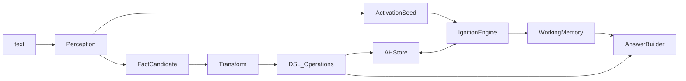

# Контракты модулей

Граница: Perception не пишет в граф; AH мутируется только через DSL/Operations; ответ строится из WM/трассы, не из свободной генерации БЯМ.



## 1. Perception → Transform

```python
@dataclass(frozen=True)
class FactCandidate:
    predicate: str              # e.g. "LIVE_IN"
    roles: dict[str, str]       # RoleName -> surface / UID hint
    raw_span: str | None = None
    confidence: float = 1.0

@dataclass(frozen=True)
class PerceptionResult:
    kind: Literal["fact", "question", "message"]
    candidates: list[FactCandidate]
    seed_uids: list[str]        # UID из S/C/P для подпитки x
    meta: dict[str, str]
```

- Вход: `text: str`, опционально `wm_context: list[str]` (UID из WM для траектории).
- Выход: `PerceptionResult`.
- БЯМ возвращает JSON по схеме; валидация строгая — битые кандидаты отбрасываются.

## 2. Transform → DSL

```python
@dataclass(frozen=True)
class OpCall:
    op: str                     # имя из таблицы 3
    args: dict[str, Any]

@dataclass(frozen=True)
class TransformResult:
    ops: list[OpCall]
    seed_uids: list[str]
```

Правила: match шаблона `T` по `predicate`; resolve/create символов в S/C; сборка `N` с ролями; `addElement` / `addLink`. Никаких прямых `ah.C.add(...)`.

## 3. DSL → AHStore

Сигнатуры Junior (минимум) и полный контракт Senior:

| op | signature |
|----|-----------|
| addAbstractSymbol | `(s) → S` |
| editAbstractSymbol | `(uid, s) → S` |
| addElement | `(section: C\|P\|H, e) → section` |
| editElement | `(section, uid, e) → section` |
| addProperty / editProperty | `(uid, prop) → e` |
| addLink | `(l) → L` |
| getAbstractSymbol | `(uid) → s` |
| findAbstractSymbols | `(query) → {s}` |
| getSReference / findSReferences | … |
| getMReference / findMReferences | … |
| getSymbol | `(uid) → m` |
| findSymbols | `(query) → {m}` |
| getList / findLists | … |
| getTemplate | `(uid) → T` |
| getHypernode / findHypernodes | … |
| findRoles | `(role, value) → {N}` |
| getLink / findLinks | `(e) → {l}` |

Интерпретатор DSL: текст запроса → композиция OpCall (пересечения множеств UID).

## 4. Perception / Pacemaker → Ignition

```python
@dataclass(frozen=True)
class ActivationSeed:
    uid: str
    delta_x: float

@dataclass
class TickTrace:
    tau: int
    activated: list[str]        # UID с x > t
    wm: list[str]
    weight_updates: int
    beliefs_top: dict[str, float]
    activation_top: dict[str, float]
    events: list[ActivationEvent]
    convergence: float
    timings_ms: dict[str, float]
```

- `seed(seeds: list[ActivationSeed])` — до/во время такта.
- `tick() → TickTrace` — compatibility API для Agent/UI.
- `initialize(evidence) → BPState`, `tick(state) → BPState` — независимый simulation API.
- Pacemaker с частотой `ν` вызывает `seed` на выбранных UID.

```python
@dataclass
class BPState:
    tick: int
    variable_to_factor: dict
    factor_to_variable: dict
    beliefs: dict[str, float]
    activation: dict[str, float]
    evidence: dict[str, float]
    working_memory: dict[str, dict]
    trace: list[ActivationEvent]
```

Один immutable `FactorGraph` допускает несколько независимых `BPState`.
`BeliefPropagation.step` не сбрасывает сообщения.

## 5. Ignition → Working Memory

```python
class WorkingMemory:
    def sync(self, activation: Mapping[str, float], *, tick: int, threshold: float) -> None: ...
    def contents(self) -> frozenset[str]: ...
    def entries(self) -> tuple[WorkingMemoryEntry, ...]: ...
```

WM = `{ e | x_e >= t }`. Entry хранит activation, `entered_at` и
supporting factor UIDs. Выход ниже порога удаляет entry из WM.

## 6. AnswerBuilder

Вход: `question`, `wm`, `trace`, доступ к `findRoles` / `getHypernode`.  
Выход: `{ answer: str, trace_uids: list[str], correct_source: "graph" }`.  
NLG по UID — опционально; факты только из графа (M2).

## 7. GC → AHStore

```python
def collect(ah: AHStore, tau: int) -> GCReport:
    # orphan: все w in/out == 0 ИЛИ компонент без связи с S
    # skip: created_at_tau + TTL > tau
```

## 8. Open relation semantics

```python
normalized = RelationNormalizer(registry, strategies).normalize(
    raw_relation,
    context,
)

registry.register_relation(relation)
registry.get_relation(canonical_label)
registry.find_similar_relations(embedding)
registry.list_relations()
```

`FactCandidate.predicate` remains a legacy canonical fallback.
`raw_relation` is never overwritten; `canonical_relation` is stored
separately.

```python
message = ActivationEngine(function, parameter_generator).propagate(
    message,
    factor,
    source,
    target,
)
```

Activation behavior is selected by FactorParameters and
RelationProperties, not by relation-label branches.

```python
next_state = StateEngine(rules).apply(state, event)
```

State transitions are deterministic configured operations. The LLM
cannot mutate State or FactorGraph directly.

## Запреты

1. Perception → AH напрямую.
2. Ответ «из головы» БЯМ без UID-трассы.
3. Явный delete вне GC (кроме тестового API оргкомитета для M3).
